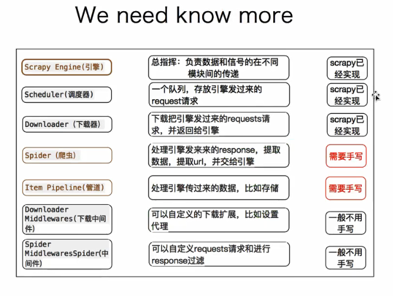
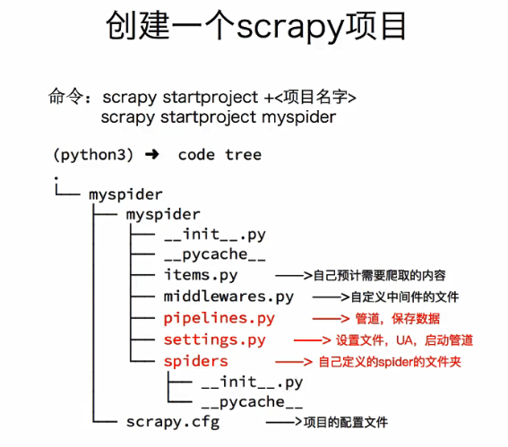
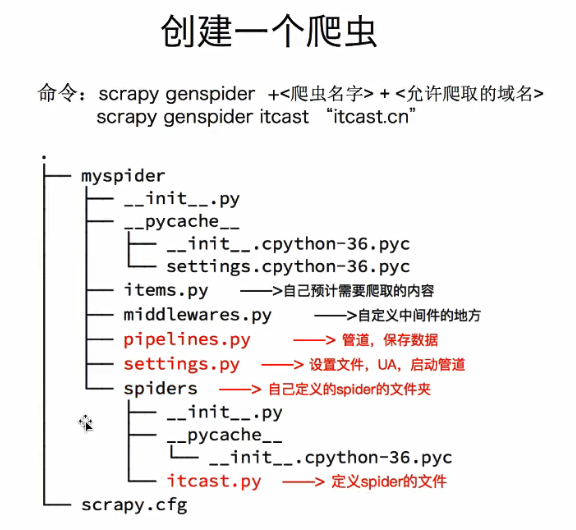

# 1.scrapy基础概念

## 为什么要学习scrapy

> 1. requests+selenium可以解决90%的爬虫需求，但是单线程，速度慢，抓取效率低。
> 2. scrapy是为了提高爬虫速度、效率

## 什么是scrapy

> 1. Scrapy是一个为了爬取网站数据，提取结构性数据而编写的应用框架，只需要编写少量的代码，就能够快速的抓取。
> 2. Scrapy使用了 **Twisted** **异步** 网络框架，可以加快爬虫速度。

### 补充：异步和非阻塞的区别

> 1. 异步：**调用**在发出之后，这个调用就直接返回，不管有没有结果。
> 2. 非阻塞：关注的是程序在等待调用结果(消息，返回值)时的**状态**，指在不能立刻得到结果之前，该调用不会阻塞当前的线程。

# 2.scrapy工作流程

# 3.scrapy入门使用

> 1. 创建一个scrapy项目
>       - scrapy startproject mySpider
> 2. 生成一个爬虫
>       - scrapy genspider itcast 'itcast.cn'
> 3. 提取数据
>       - 完善spider,使用xpath等方法
> 4. 保存数据
>       - pipline中保存数据

# 4.scrapy深入学习

# 5.carwlspider使用